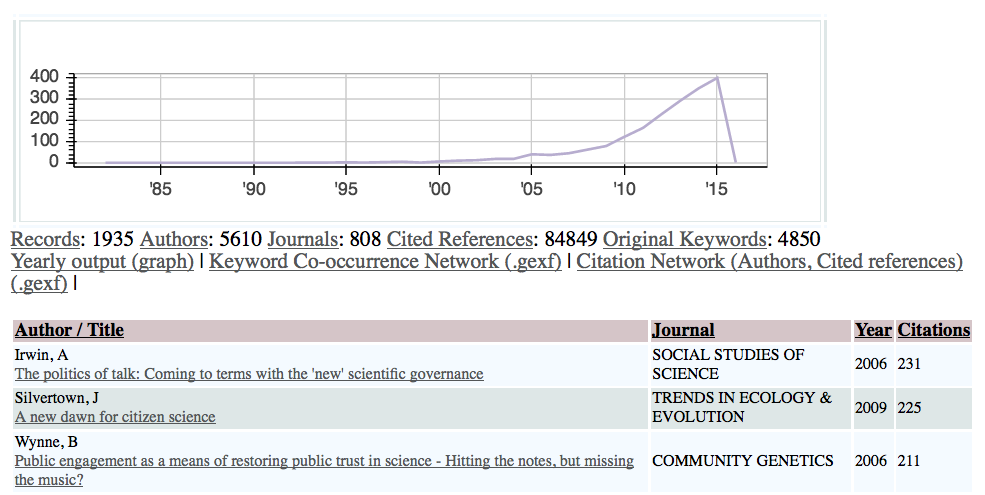

# Cite.py

A Python program for analyzing bibliographic data in your browser. The current version supports data exported from the Thomson Reuters Web of Science.

The long-term purpose of this program is to create similar functionality as in the [Histcite](https://en.wikipedia.org/wiki/Histcite) package, but using free software instead of proprietary. This way, it will be easier for researchers to modify specific functions for pursuing their research questions.

It should be noted that this software should be interpreted more as a suggestion or concept, not as a user-friendly and ready-made application.

Features include:

* Sort publications by Author, Years, Keywords, Source, Times Cited.
* Analyze Cited References.
* Export word co-occurrence networks and co-author networks as .gexf files for further analysis in [Gephi](http://gephi.org).
* Easy-to-share output (a few static html files).

### Requirements
This program is written in Python 3. The following external packages are required:

* pandas
* bokeh
* lxml
* pygexf

Depending on your platform, lxml and pygexf may have to be compiled from source rather than relying on the standard package managers. Please google a bit, things may be especially complicated in Windows regarding lxml.

#### External software bundled with this repository
This program uses [Tsorter by Terrill Dent](https://github.com/terrilldent/tsorter), which is licensed under the MIT licence.  

## Usage
**Input data**: Use with data exported as .tsv files from [Web of Science](http://webofknowledge.com). I have only tried with the "Mac OS/UTF-8" output option.

    python3 Cite.py YOURDATA.tsv

The script will automatically start up a webserver running on port 8000. Go to ``localhost:8000`` with your favourite browser (with support for Javascript). You can use the included ``example_data.tsv`` as a test dataset.

## Output
The script will create a handful of html files and gexf network files.

## Known bugs
* Large datasets (more than tens of thousands of articles) will eventually make the Javascript sorting function very slow. Currently the software will limit the number of records to the 500 most cited. Change the value in ``for record in dict(collections.Counter(indexbodydict).most_common(500))`` to increase this number.

## Todo / Future updates

* Enable larger data sets (se above).
* Enable more input files, such as Scopus, SwePub etc.
* Add more useful functionality.
* ??? (please send me a message to suggest further improvements).
